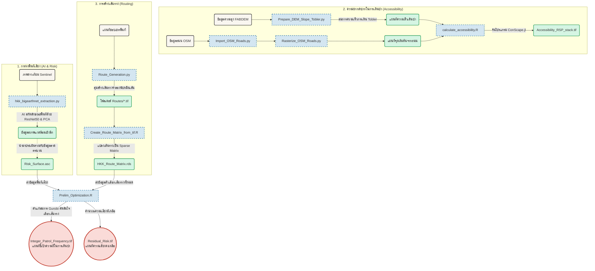

# 🌳 Huai Kha Khaeng (HKK) Wildlife Sanctuary Patrol Optimization

[](https://opensource.org/licenses/MIT)

โปรเจกต์นี้ใช้โมเดล Deep Occupancy และการวิเคราะห์โครงข่าย (Network Analysis) เพื่อสร้างแบบจำลองการจัดสรรเส้นทางลาดตระเวนระดับสูง สำหรับยกระดับขีดความสามารถในการป้องกันเขตรักษาพันธุ์สัตว์ป่าห้วยขาแข้ง การทำงานอ้างอิงจากหลักการทางคณิตศาสตร์แบบ Mixed-Integer Linear Programming (MILP)

## 📑 สถาปัตยกรรมของโปรเจกต์ (Project Overview)
โปรเจกต์นี้ผสานรวมเทคนิคขั้นสูง 3 ส่วนเข้าด้วยกัน:
1. **AI Pipeline (BigEarthNet):** การใช้ BigEarthNet แบบ "OG" (Transfer Learning) ผ่านโมเดล ResNet-50 สกัดคุณลักษณะสภาพแวดล้อม (Deep Embeddings 2,048 มิติ) จากภาพถ่ายดาวเทียม Sentinel รายเดือน และลดมิติด้วย PCA เพื่อใช้เป็นตัวแปร (Covariates) ป้อนให้ Occupancy Model อย่างมีประสิทธิภาพ
2. **Accessibility & Threat-Access Model:** คำนวณความยากง่ายในการเข้าถึงพื้นที่ด้วยข้อมูล DEM และสมการ Tobler's hiking function ผ่านอัลกอริทึม Randomized Shortest Paths (RSP)
3. **Patrol Optimization (MILP):** สังเคราะห์เส้นทางลาดตระเวนผ่าน NetworkX และหาผลเฉลยด้วยตัวแก้สมการ Gurobi เพื่อจัดสรรทรัพยากรบุคคล (รปภ.ป่าไม้) ให้เกิดผลสัมฤทธิ์เชิงพื้นที่สูงสุด

---

## 📂 โครงสร้างโฟลเดอร์ (Directory Structure)

```text
MS-Patrol-Optimization/
│
├── Data/                       # พื้นที่จัดเก็บข้อมูล (*ไม่อัปโหลดขึ้น GitHub)
│   ├── raw/
│   ├── osm/                    # ข้อมูลเส้นทาง OpenStreetMap 
│   ├── raster/                 # ไฟล์ผลลัพธ์ (เช่น Resistance, Accessibility)
│   ├── BigEarthNet/            # ผลลัพธ์จากการสกัดฟีเจอร์ AI
│   └── Routes/                 # เส้นทางจำลอง (TIFF)
│
├── Scripts/                    # ชุดคำสั่งประมวลผลหลัก
│   ├── Import_OSM_Roads.py         # โหลดข้อมูล OSM (EPSG:32647)
│   ├── Prepare_DEM_Slope_Tobler.py # เตรียม DEM และหาค่า Tobler Hiking Speed
│   ├── Rasterize_OSM_Roads.py      # แปลง OSM Vector เป็น Raster
│   ├── calculate_accessibility.R   # คำนวณ Accessibility ผ่าน ConScape.jl (RSP)
│   ├── hkk_bigearthnet_extraction.py # ประมวลผลภาพดาวเทียมผ่าน GEE และทำ PCA
│   ├── check_npy_files.py          # ตรวจสอบความสมบูรณ์ของไฟล์ NPY
│   ├── Route_Generation.py         # สร้างเส้นทางลาดตระเวนจำลอง (Stochastic routes)
│   ├── Create_Route_Matrix_from_tif.R # แปลงเส้นทางเป็น Sparse Matrix
│   └── Prelim_Optimization.R       # หาเส้นทางเหมาะสมด้วย Gurobi
│
├── Doc/                        # เอกสารอ้างอิงและคู่มือ
│   ├── Proposal_Method.docx
│   └── Accessibility_Method.pdf
│
├── .gitignore                  
└── README.md                   
```

---

## 🛠️ ข้อกำหนดเบื้องต้น (Prerequisites)

* **Python 3.8+**: ติดตั้ง `geopandas`, `rasterio`, `torch`, `timm`, `earthengine-api`, `networkx`, `scikit-learn`
* **R 4.6.1+**: ติดตั้งแพ็กเกจ `terra`, `Matrix`, `igraph`, `gdistance`, `JuliaConnectoR` และ `gurobi`
* **Julia 1.12+**: สำหรับใช้งาน `ConScape.jl` (ต้องทำ Setup ผ่าน `ConScapeR` ใน R ก่อน)
* **Gurobi Optimizer**: ต้องมีไลเซนส์และติดตั้ง Gurobi (เช่น version 12.0-3) ให้เรียบร้อยเพื่อรันสคริปต์ Optimization

---

## 🚀 ขั้นตอนการรันโปรเจกต์ (Workflow)

**Part 1: พื้นผิวความยากง่ายในการเข้าถึง (Accessibility Modeling)**
1. รัน `Import_OSM_Roads.py` เพื่อดึงข้อมูลถนน
2. รัน `Prepare_DEM_Slope_Tobler.py` แปลง FABDEM เป็นค่าความเร็วเดินป่า
3. รัน `Rasterize_OSM_Roads.py` 
4. รัน `calculate_accessibility.R` เพื่อสร้างพื้นผิว RSP (สคริปต์นี้จะจัดการรัน Julia เบื้องหลัง)

**Part 2: การสกัดลักษณะเด่นด้วย AI (BigEarthNet Pipeline)**
1. ให้สิทธิ์ใช้งาน Google Earth Engine (`earthengine authenticate`)
2. รัน `hkk_bigearthnet_extraction.py` (จะดึงภาพ ทำ ResNet50 Embeddings และรัน PCA ให้อัตโนมัติ)
3. รัน `check_npy_files.py` เพื่อเช็กความสมบูรณ์ของข้อมูล

**Part 3: การสร้างและคัดเลือกเส้นทาง (Patrol Optimization)**
1. รัน `Route_Generation.py` เพื่อสร้างเส้นทางสุ่ม (Stochastic routes) ระหว่างจุด
2. รัน `Create_Route_Matrix_from_tif.R` รวมเส้นทางเป็น Sparse Matrix (`.rds`)
3. รัน `Prelim_Optimization.R` เพื่อให้ Gurobi เลือกแผนการเดินป่าที่ดีที่สุด ภายใต้งบประมาณที่มีอยู่

---

## 📊 แผนภาพการทำงานของระบบ (Pipeline Flowchart)


